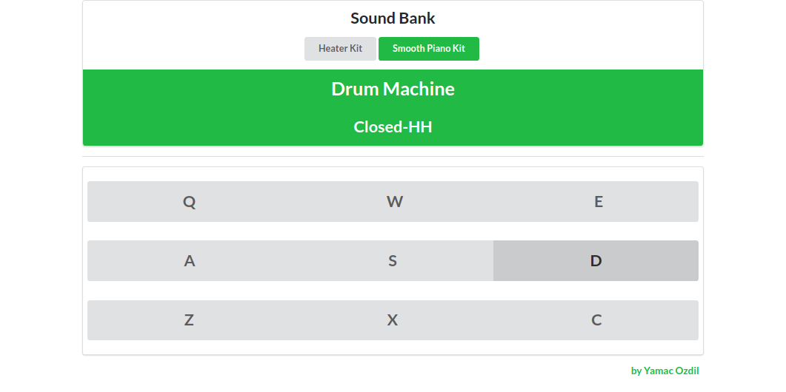

<h1 align="center">Welcome to Drum Machine 👋</h1>

## About



[Drum Machine](https://csb-wfx43.netlify.app/) was done for Front End Development Libraries Certification at [freeCodeCamp](https://www.freecodecamp.org). At it's core it uses React and Semantic UI for simple visuals and mobile responsiveness. It accepts button clicks or key press in order to make your tune!


> Also check out [Nicholas Meisenheimer](https://github.com/souredoutlook)'s awesome [CREATION](https://youtu.be/cwlLqKxfED4) that will probably make it straight to the top charts.


### ✨ [Demo](https://csb-qk26u.netlify.app/)


## Install

```sh
npm install
```

## Usage

```sh
npm run start
```

## Run tests

```sh
npm run test
```

## Author

👤 **Yamac Ozdil**

- Website: yamacozdil.com
- Github: [@yozdil](https://github.com/yozdil)
- LinkedIn: [@yamac-ozdil](https://linkedin.com/in/yamac-ozdil)
